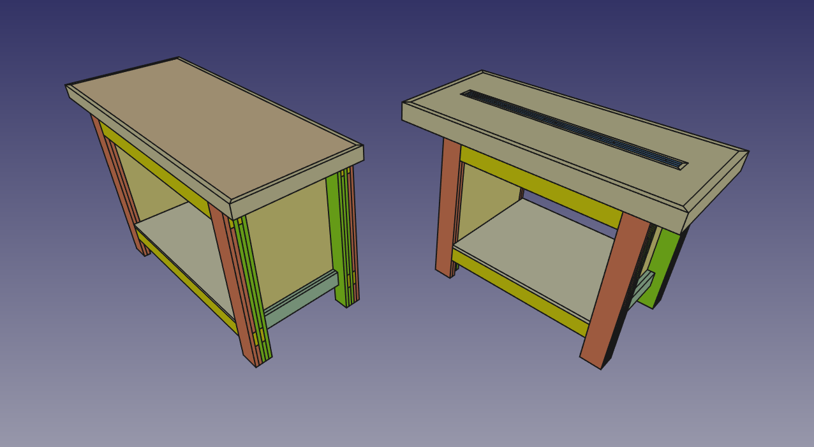

Workbench
=========

This is a FreeCAD model of a workbench based on one designed by
[Neil Paskin][neil_paskin], and the [plans][plans] he published.

Both the [original version](workbench_pask.fcstd) and the
[modified version](workbench_spbnick.fcstd) are present.

[neil_paskin]: http://paskmakes.com/
[plans]: http://paskmakes.com/product/workbench-plans/
